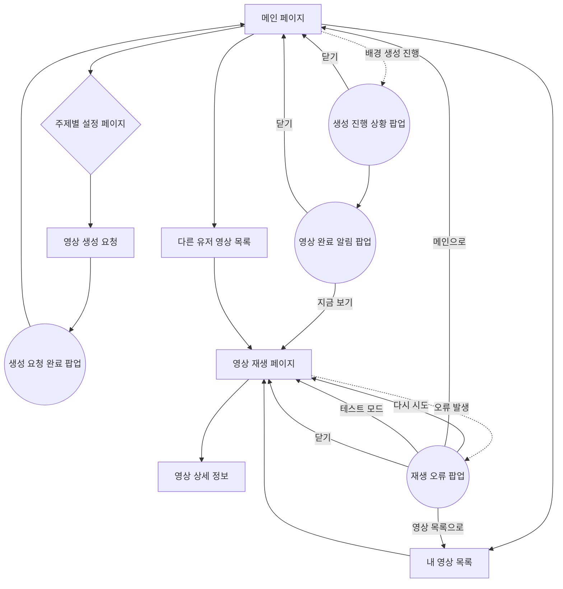

# LG AI 영상 생성 웹 서비스 - 페이지 플로우

## 📋 개요
본 문서는 LG AI 영상 생성 웹 서비스의 페이지 플로우를 정리한 문서입니다. 유저의 취향에 맞는 영상을 AI를 통해 생성하여 재생할 수 있는 웹 서비스의 전체 흐름을 체계적으로 설명합니다.

### 🖥️ 화면 사양
- **해상도**: 1920 × 1080 (Full HD)
- **화면 방향**: 가로형 (Landscape)
- **화면 비율**: 16:9
- **UI 설계**: 가로형 화면에 최적화된 레이아웃

### 🌐 외부 변수 시스템 특징
- **자동 감지**: 외부 변수는 영상 생성 시 유저가 설정하는 값이 아닙니다
- **실시간 연동**: 영상 재생 시 IoT 장비나 외부 API를 통해 현재 환경 정보를 자동으로 획득
- **동적 재생**: 감지된 외부 변수에 해당하는 영상 클립을 자동으로 선택하여 재생
- **테스트 기능**: 개발/테스트 환경에서는 외부 변수를 수동으로 조작할 수 있는 UI 제공

---

## 🔄 전체 웹페이지 플로우



---

## 📄 페이지별 상세 플로우

### 1. 메인 페이지 (Landing Page)
- **목적**: 서비스 소개 및 주요 기능 접근점 제공, 콘텐츠 주제 직접 선택
- **주요 요소**:
  - 서비스 개요 및 소개
  - 10개 콘텐츠 주제 카드 (5×2 그리드 레이아웃)
  - 각 주제별 미리보기 GIF 및 설명
  - 내 영상 목록 바로가기
  - 다른 유저 영상 목록 바로가기
- **사용자 액션**:
  - 콘텐츠 주제 카드 클릭 → 해당 주제 설정 페이지로 직접 이동
  - 기존 영상 목록 보기
- **플로우 특징**:
  - 별도의 콘텐츠 주제 선택 페이지 없이 메인에서 바로 선택 가능
  - 원스톱 서비스 제공으로 사용자 경험 단순화

### 2. 주제별 설정 페이지
각 콘텐츠 주제마다 고유한 설정 페이지가 존재합니다. 메인 페이지에서 주제를 선택하면 바로 해당 주제의 설정 페이지로 이동합니다.

#### 2.1 명상 설정 페이지
- **테마 선택**: 힐링 관련 옵션들
- **분위기 설정**: 차분함 정도 조절
- **배경음 선택**: 자연음, 클래식 등

#### 2.2 비주얼아트 설정 페이지
- **테마 선택**: 운동, 공부, 요가, 산책, 여행, 독서, 드라이브
- **외부 변수 안내**: 시간대와 계절은 재생 시 자동 감지됨을 안내
  - 시간대: 시스템 시간 또는 IoT 조도센서 기반 자동 감지
  - 계절: 현재 날짜 또는 기상 API 기반 자동 판단
- **생성 클립 수**: 시간대(4) × 계절(4) = 16개 (모든 조합 자동 생성)

#### 2.3 애완동물 설정 페이지
- **동물 종류**: 강아지, 고양이, 토끼, 햄스터
- **외부 변수 안내**: 장소(실내/실외)는 재생 시 자동 감지됨을 안내
  - GPS 위치정보 또는 IoT 센서 기반 자동 감지
- **생성 클립 수**: 장소(2) = 2개 (실내/실외 모두 생성)

#### 2.4 시계 설정 페이지
- **테마 선택**: 자연, 도시, 우주, 미니멀, 빈티지
- **폰트 선택**: 5가지 숫자 폰트 중 선택
- **생성 클립 수**: 1개

#### 2.5 아바타 설정 페이지
- **사진 업로드**: PC에서 단독 인물 사진 선택
- **테마 선택**: 운동, 공부, 산책
- **스타일 선택**: 애니메이션, 3D 등 캐릭터화 스타일
- **생성 클립 수**: 1개

#### 2.6 인테리어 설정 페이지
- **사진 업로드**: PC에서 실내 공간 사진 선택
- **테마 선택**: 미니멀, 모던, 럭셔리, 빈티지, 내추럴
- **생성 클립 수**: 1개

#### 2.7 기념앨범 설정 페이지
- **사진 업로드**: PC에서 단체 사진 선택
- **테마 선택**: 졸업, 결혼, 여행 등
- **타임랩스 스타일**: 하루 시간 흐름 속도 조절
- **생성 클립 수**: 1개

#### 2.8 음악감상 설정 페이지
- **음악 파일 업로드**: PC에서 MP3 파일 선택
- **장르 선택**: 팝, 록, 재즈 (ID3 태그 기반 자동 감지)
- **분위기 선택**: 신나는, 차분한
- **생성 클립 수**: 장르(3) × 분위기(2) = 6개

#### 2.9 날씨 설정 페이지
- **테마 선택**: 도시, 해변, 산, 호수
- **위치 설정**: 현재 위치 또는 수동 입력
- **날씨 API 연동**: 실시간 기상 정보 자동 반영
- **생성 클립 수**: 날씨(4) × 시간대(2) = 8개

#### 2.10 식물키우기 설정 페이지
- **식물 종류**: 다양한 꽃과 식물 중 선택
- **초기 습도 설정**: 건조, 적절, 습윤
- **관리 알림 설정**: 물주기, 관리 주기 설정

### 3. 영상 생성 요청 확인 페이지
- **목적**: 설정 내용 최종 확인 및 생성 요청
- **주요 요소**:
  - 선택한 주제 및 설정 요약
  - 예상 생성 시간 안내
  - 생성 클립 수 안내
  - 생성 요청 최종 확인 버튼
- **사용자 액션**:
  - 설정 수정 (이전 페이지로 이동)
  - 생성 요청 확정 → 성공 시 '생성 요청 완료 팝업' 표시 (OK 누르면 메인 페이지로 이동)

### 3-1. AI 제목 생성 프로세스
- **목적**: LLM을 활용하여 영상 콘텐츠와 테마에 맞는 창의적인 제목 자동 생성
- **실행 시점**: 영상 생성 요청 확정 후, 서버 백그라운드에서 실행

#### 📋 LLM 입력 데이터 구조
```json
{
  "content_code": "visual_art",
  "content_name": "비주얼아트",
  "theme_code": "exercise",
  "theme_name": "운동"
}
```

#### 🤖 LLM 프롬프트 템플릿
```
당신은 영상 제목 전문가입니다. 다음 정보를 바탕으로 매력적이고 창의적인 영상 제목을 생성해주세요.

콘텐츠: {content_name}
테마: {theme_name}

제목 생성 규칙:
1. 15자 이내로 작성
2. 감성적이고 호소력 있는 표현 사용
3. 콘텐츠와 테마의 특징을 잘 드러낼 것
4. 이모지 사용 가능
5. 3개의 후보 제목 제시

출력 형식 (JSON):
["제목1", "제목2", "제목3"]
```

#### ✅ 정상 플로우
1. **요청 단계**
   - 사용자가 영상 생성 요청 확정
   - 서버가 콘텐츠/테마 정보 수집
   - LLM API 호출 준비

2. **LLM 처리 단계**
   - OpenAI GPT-4 또는 Claude API 호출
   - 타임아웃: 15초
   - 3개의 제목 후보 생성

3. **제목 선택 단계**
   - 첫 번째 제목을 기본 선택
   - `videos.title` 필드에 저장
   - 나머지 2개는 `videos.generation_settings.alternative_titles`에 저장

4. **영상 생성 진행**
   - 제목이 확정되면 영상 생성 Queue에 등록
   - 생성 진행 상황 팝업에 제목 표시

#### ❌ 예외 상황 및 처리

##### 1) LLM API 응답 지연
- **발생 조건**:
  - API 응답 시간 > 15초
  - 네트워크 타임아웃
- **처리 방법**:
  - 기본 제목 템플릿 사용: `"{content_name} - {theme_name}"`
  - 예: "비주얼아트 - 운동"
  - 로그 기록: "LLM timeout, fallback to default title"
- **사용자 영향**: 없음 (백그라운드 처리)

##### 2) LLM API 오류 응답
- **발생 조건**:
  - HTTP 500/502/503 응답
  - API 키 만료 또는 할당량 초과 (429 에러)
  - 잘못된 응답 형식
- **처리 방법**:
  - 기본 제목 템플릿 사용
  - 재시도 로직: 최대 2회, 5초 간격
  - 관리자 알림 발송 (API 키 확인 필요)
- **사용자 영향**: 없음

##### 3) 부적절한 제목 생성
- **발생 조건**:
  - 비속어, 혐오 표현 포함
  - 제목 길이 > 50자
  - 특수문자 과다 사용
- **처리 방법**:
  - 컨텐츠 필터링 시스템 적용
  - 금지어 사전 체크
  - 필터링 실패 시 기본 제목 사용
  - 필터링된 제목은 로그에 기록
- **사용자 영향**: 없음

##### 4) JSON 파싱 오류
- **발생 조건**:
  - LLM이 배열 형식이 아닌 텍스트 반환
  - 잘못된 JSON 구조
  - 빈 응답
- **처리 방법**:
  - 정규표현식으로 제목 추출 시도
  - 추출 실패 시 기본 제목 사용
  - 응답 원본을 로그에 기록
- **사용자 영향**: 없음

##### 5) 중복 제목 생성
- **발생 조건**:
  - 동일 사용자가 같은 콘텐츠/테마로 여러 영상 생성
  - LLM이 유사한 제목 반복 생성
- **처리 방법**:
  - 기존 제목과 중복 체크
  - 중복 시 타임스탬프 추가: `"{title} (2)"`
  - 또는 LLM에 재생성 요청 (1회)
- **사용자 영향**: 없음

#### 🔄 제목 재생성 기능 (향후 확장)
- **사용자 요청 제목 변경**:
  - 영상 상세 정보 페이지에서 제목 편집 버튼
  - LLM 재생성 또는 수동 입력 선택 가능
  - 변경 이력 `videos.title_history` JSON 필드에 저장

#### 📊 제목 생성 성능 모니터링
- **추적 지표**:
  - LLM API 응답 시간 (평균/최대)
  - 성공률 (%)
  - 폴백 사용 빈도
  - 사용자 제목 수정 비율
- **로그 기록 필드**:
  ```json
  {
    "llm_provider": "openai",
    "model": "gpt-4-turbo",
    "response_time_ms": 3240,
    "success": true,
    "fallback_used": false,
    "generated_titles": ["에너지 넘치는 운동 타임", "활력 충전 운동 시간", "파워풀 운동 세션"],
    "selected_title": "에너지 넘치는 운동 타임",
    "timestamp": "2025-10-21T14:30:05Z"
  }
  ```

#### 💡 제목 생성 예시

| 콘텐츠 | 테마 | AI 생성 제목 예시 |
|:------|:----|:----------------|
| 비주얼아트 | 운동 | "에너지 넘치는 운동 타임 💪" |
| 비주얼아트 | 공부 | "집중의 시간, 성장의 순간 📚" |
| 명상 | 힐링 | "평온한 마음의 여행 🧘" |
| 애완동물 | 강아지 | "행복한 멍멍이의 하루 🐕" |
| 시계 | 자연 | "자연과 함께 흐르는 시간 🌿" |
| 아바타 | 운동 | "나만의 트레이닝 파트너 💫" |
| 날씨 | 도시 | "도심 속 날씨 이야기 🌤️" |
| 음악감상 | 팝 | "리듬 속으로 빠져들다 🎵" |

---

### 4. 생성 진행 상황 팝업 (Modal)
- **목적**: 별도 페이지 이동 없이 진행 상황을 간단히 안내
- **표시 내용**:
  - AI 생성 제목 표시 (LLM 생성 완료 시)
  - 대기열 위치, 진행률 바(%)
  - 필요 최소 정보만 노출 (ETA/서버 상태 등은 생략)
- **사용자 액션**:
  - [OK] → 팝업 닫기 (화면 이동 없음)
- **비고**:
  - 서버 생성 Queue는 백그라운드로 진행되며 WebSocket/폴링으로 상태 업데이트
  - 제목 생성 중: "제목 생성 중..." 로딩 표시
  - 제목 생성 완료: AI 생성 제목 표시

### 5. 영상 완료 알림 팝업 (Modal)
- **목적**: 별도 페이지 없이 생성 완료 결과 간단 안내
- **표시 내용**:
  - 완료 메시지
  - AI 생성 제목 (크게 강조)
  - 썸네일, 길이(00:30 등) 등 최소 정보
- **사용자 액션**:
  - [지금 보기] → 해당 영상 재생 페이지로 이동
  - [닫기] → 팝업 닫기 (화면 이동 없음)
- **접근성**:
  - Enter로 기본 버튼(지금 보기) 실행, Esc로 닫기

### 6. 영상 재생 페이지
- **목적**: 생성된 영상 스트리밍 재생
- **주요 요소**:
  - 영상 플레이어 (30초 반복 재생)
  - 음량 조절
  - 전체화면 모드
  - 재생/일시정지 컨트롤
  - 영상 정보 표시
- **외부 변수 자동 감지 기능**:
  - IoT 센서 및 외부 API를 통한 실시간 환경 정보 획득
  - 환경 변화에 따른 자동 클립 전환
  - 현재 외부 변수 상태 실시간 표시
- **테스트 UI (개발/테스트 환경 전용)**:
  - 외부 변수 수동 조작 패널
  - 비주얼아트: 시간대(아침/낮/저녁/밤), 계절(봄/여름/가을/겨울) 드롭다운
  - 애완동물: 실내/실외 토글 버튼
  - 날씨: 날씨상태(맑음/흐림/비/눈), 시간대(낮/밤) 선택
  - 식물키우기: 습도(건조/적절/습윤) 슬라이더
  - 실시간 클립 변경 미리보기
- **스트리밍 기능**:
  - 서버에서 실시간 스트리밍
  - 적응형 비트레이트 지원
  - 반복 재생 옵션
  - 외부 변수 변경 시 즉시 클립 전환
- **오류 처리**:
  - 영상 로드 실패 시 자동 재시도 (최대 3회)
  - 네트워크 오류 발생 시 '재생 오류 팝업' 표시
  - 클립 전환 실패 시 기본 클립으로 폴백

### 6-1. 재생 오류 팝업 (Error Modal)
- **목적**: 영상 재생 중 발생하는 오류 상황 안내 및 해결 방법 제시
- **오류 유형별 표시 내용**:

#### 1) 서버 오류 (500 에러)
- **발생 조건 (시스템)**:
  - HTTP 500 Internal Server Error 응답
  - HTTP 502 Bad Gateway 응답
  - HTTP 503 Service Unavailable 응답
  - API 엔드포인트 응답 지연 (60초 초과)
  - 서버 메모리 부족 또는 과부하
  - 데이터베이스 연결 실패
- **오류 메시지**: "일시적인 서버 오류가 발생했습니다"
- **상세 설명**: "잠시 후 다시 시도해주세요"
- **아이콘**: 🔧 서버 아이콘
- **버튼**:
  - [다시 시도] → 30초 후 자동 재시도
  - [메인으로] → 메인 페이지로 이동

#### 2) 클립 없음 오류
- **발생 조건 (시스템)**:
  - `video_clips` 테이블에서 현재 External_Param 조합과 일치하는 레코드 없음
  - `external_variables` JSON 필드 매칭 실패
  - 클립 생성 시 특정 조합 누락 (예: 비주얼아트 16개 중 일부만 생성)
  - `video_clips.clip_url` 필드가 NULL 또는 빈 문자열
  - CDN에서 해당 클립 파일 404 응답
- **오류 메시지**: "재생 가능한 클립이 없습니다"
- **상세 설명**: "현재 External_Param 조건에 맞는 영상 클립이 생성되지 않았습니다"
- **아이콘**: 📹 비디오 아이콘
- **버튼**:
  - [기본 영상 재생] → 기본 클립으로 재생
  - [영상 목록으로] → 내 영상 목록 페이지로 이동

- **팝업 공통 속성**:
  - 화면 중앙 모달 형태
  - 반투명 배경 오버레이
  - ESC 키로 닫기 가능
  - 자동 로그 기록 (오류 추적용)
  - 오류 코드 표시 (하단 작은 글씨)
  - 오류 발생 시각 타임스탬프 기록

### 7. 내 영상 목록 페이지
- **목적**: 사용자가 생성한 영상들 관리
- **주요 요소**:
  - 생성 날짜순 영상 목록
  - 썸네일 그리드 레이아웃
  - 영상별 메타데이터 (주제, 생성일, 재생시간)
  - 정렬 옵션 (최신순, 주제별)
- **필터링 기능**:
  - 기본 정렬만 제공

### 8. 다른 유저 영상 목록 페이지
- **목적**: 공개된 다른 유저들의 영상 탐색
- **주요 요소**:
  - 주제별 카테고리
- **추천 시스템**:
  - 기본 주제별 분류만 제공

### 9. 영상 상세 정보 페이지
- **목적**: 개별 영상의 상세 정보 제공
- **주요 요소**:
  - 영상 제작자 정보 (익명화된 ID)

---

## 🔧 기술적 구현 요소

### LLM 제목 생성 시스템
- **LLM 제공자**: OpenAI GPT-4 또는 Anthropic Claude
- **API 통합**: RESTful API 호출, 비동기 처리
- **폴백 전략**: 3단계 폴백 시스템
  1. LLM 생성 제목 (우선순위 1)
  2. 템플릿 기반 제목 (우선순위 2)
  3. 고정 기본 제목 (최종 폴백)
- **캐싱**: 동일 콘텐츠/테마 조합의 제목 후보 7일간 캐시
- **비용 최적화**: 일 호출 제한, 배치 처리
- **컨텐츠 필터**: 욕설/혐오 표현 필터링 시스템

### 오류 처리 시스템
- **자동 재시도 로직**: 일시적 오류 발생 시 최대 3회 자동 재시도
- **폴백 메커니즘**: 클립 로드 실패 시 기본 클립으로 대체
- **오류 로깅**: 모든 오류 상황 서버 로그 자동 기록
- **사용자 피드백**: 명확한 오류 메시지와 해결 방법 제시
- **네트워크 상태 모니터링**: 실시간 연결 상태 체크 및 알림

### 사용자 식별
- **Mac Address 기반 유저 구분**
- **세션 관리 및 로그인 불필요**
- **개인정보 최소화 수집**

### 실시간 알림 시스템
- **WebSocket 연결을 통한 실시간 업데이트**
- **영상 생성 완료 푸시 알림**
- **대기열 상태 실시간 동기화**

### 파일 업로드 처리
- **이미지 파일**: JPG, PNG 지원
- **음악 파일**: MP3 지원 (ID3 태그 분석)
- **파일 크기 제한 및 포맷 검증**
- **업로드 진행률 표시**

### 외부 API 연동
- **기상 정보 API**: OpenWeatherMap 등 활용
- **실시간 날씨 데이터 반영**
- **위치 기반 서비스**

---

## �️ 화면 사양 및 레이아웃 고려사항

### 기본 화면 사양
- **해상도**: 1920 × 1080 (Full HD)
- **화면 방향**: 가로형 (Landscape) 고정
- **화면 비율**: 16:9
- **최적화 타겟**: 데스크톱, 스마트 TV, 가로모드 태블릿

### 레이아웃 전략
- **3컬럼 레이아웃**: 사이드바(240px) + 메인(1440px) + 우측패널(240px)
- **영상 플레이어**: 1280×720 (16:9 비율) 중앙 배치
- **그리드 시스템**: 5×3 썸네일 그리드 (280×158 each)
- **반응형 조정**: 최소 1366×768까지 스케일링 지원

### 화면별 최적화
- **영상 재생**: 플레이어 중심의 시네마틱 레이아웃
- **목록 페이지**: 가로 스크롤 최소화, 세로 그리드 우선
- **설정 페이지**: 좌우 분할 레이아웃으로 정보 밀도 향상
- **모달 안내**: 생성 요청 완료/진행 상황/완료 알림은 모달로 제공

---

## 🔄 사용자 경험 플로우 요약

1. **진입** → 메인 페이지에서 서비스 파악
2. **선택** → 10개 주제 중 원하는 콘텐츠 선택  
3. **설정** → 주제별 세부 옵션 및 파일 업로드
4. **대기** → 필요 시 ‘생성 진행 상황 팝업’에서 진행 확인
5. **완료** → ‘영상 완료 알림 팝업’ 확인 후 재생/닫기 선택
6. **재생** → 스트리밍으로 영상 감상
7. **관리** → 내 영상 목록에서 재감상 및 관리
8. **탐색** → 다른 유저 영상 발견 및 감상

---

## 📋 추가 기능 제안

### 개인화 기능
- **즐겨찾는 주제** 설정
- **맞춤형 추천** 알고리즘
- **시청 기록** 관리

### 고급 기능
- **영상 편집** 기능 (길이 조절, 필터 등)
- **플레이리스트** 생성
- **오프라인 다운로드** (선택사항)

---

*이 문서는 LG AI 영상 생성 웹 서비스의 전체적인 페이지 플로우를 정리한 것으로, 실제 구현 시 세부사항은 조정될 수 있습니다.*