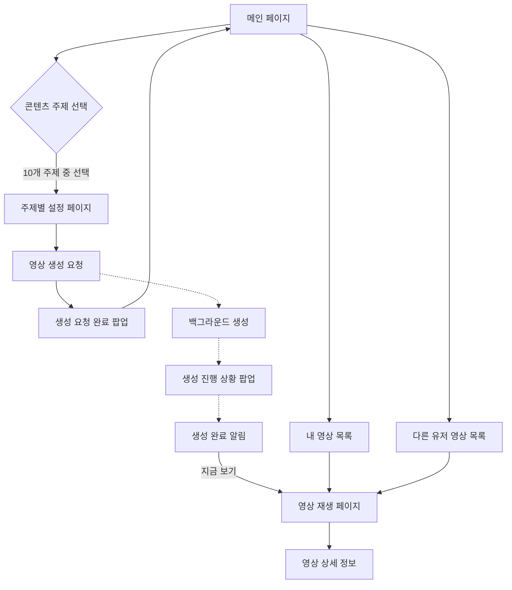

# LG AI 영상 생성 웹 서비스 - 화면 설계

## 1. 메인화면 설계

### 1.1 화면 레이아웃 구조
1. 상단 영역
   - 로고 및 브랜드 (좌측)
   - 사용자 프로필 메뉴 (우측)
   - 테스트 설정 메뉴 버튼 (좌측)

2. 히어로 섹션
   - 전체 화면 배경 이미지
   - AI FLAGSHIP 타이틀
   - 직접/간편 생성 버튼 2개

3. 컨텐츠 영역
   - 수직 스크롤 레이아웃
   - 섹션별 구분된 영상 리스트
   - 반응형 그리드 시스템

### 1.2 영상 리스트 섹션 설계

#### A. 내가 만든 영상 섹션
1. 디자인 요소
   - 섹션 타이틀: "내가 만든 영상"
   - 카드 크기: 320px × 180px
   - 그리드: 수평 스크롤 6개
   - 간격: 10px

2. 카드 구성요소
   - 썸네일 이미지 (16:9 비율)
   - NEW 뱃지 (우상단, 24시간 이내)
   - 제목 텍스트 (1줄)
   - 생성일시 (하단)
   - 그라데이션 오버레이

3. 인터랙션
   - 호버 시 확대 (scale: 1.05)
   - 플레이 버튼 페이드인
   - 부드러운 그림자 효과
   - 클릭 시 영상 재생

#### B. 추천 재생 영상 섹션
1. 디자인 요소
   - 섹션 타이틀: "추천 재생 영상"
   - 카드 크기: 320px × 180px
   - 그리드: 수평 스크롤 6개
   - 간격: 10px

2. 카드 구성요소
   - 썸네일 이미지 (16:9 비율)
   - TRENDING 뱃지 (인기 컨텐츠)
   - 제목 텍스트 (1줄)
   - 조회수 정보 (하단)
   - AI 추천 마크

3. 인터랙션
   - 호버 시 확대 (scale: 1.05)
   - 플레이 버튼 페이드인
   - 부드러운 그림자 효과
   - 클릭 시 영상 재생

#### C. 최근 플레이 영상 섹션
1. 디자인 요소
   - 섹션 타이틀: "최근 플레이 영상"
   - 카드 크기: 320px × 180px
   - 그리드: 수평 스크롤 8개
   - 간격: 10px

2. 카드 구성요소
   - 썸네일 이미지 (16:9 비율)
   - 시청 진행률 바 (하단)
   - 제목 텍스트 (1줄)
   - 마지막 시청 시간
   - 이어보기 버튼

3. 인터랙션
   - 호버 시 확대 (scale: 1.05)
   - 이어보기/처음부터 선택 메뉴
   - 진행률 바 하이라이트
   - 클릭 시 이어보기

#### D. 다른 사람이 만든 영상 섹션
1. 디자인 요소
   - 섹션 타이틀: "다른 사람이 만든 영상"
   - 카드 크기: 320px × 180px
   - 그리드: 수평 스크롤 8개
   - 간격: 10px

2. 카드 구성요소
   - 썸네일 이미지 (16:9 비율)
   - 제작자 프로필 (좌하단)
   - 제목 텍스트 (1줄)
   - 조회수/좋아요 수
   - 업로드 시간

3. 인터랙션
   - 호버 시 확대 (scale: 1.05)
   - 좋아요 버튼 표시
   - 제작자 프로필 클릭
   - 더보기 메뉴

### 1.3 공통 UI 요소

1. 네비게이션 컨트롤
   - 좌/우 스크롤 버튼
   - 스크롤바 디자인
   - 페이드 효과

2. 섹션 헤더
   - 섹션 제목 (24px)
   - 더보기 링크 (우측)
   - 구분선

3. 카드 공통 스타일
   - 둥근 모서리 (10px)
   - 그림자 효과
   - 호버 애니메이션
   - 로딩 상태

4. 반응형 처리
   - 모바일: 2열 그리드
   - 태블릿: 3열 그리드
   - 데스크톱: 4열 그리드
   - 여백 자동 조정

### 1.4 컴포넌트 스타일 가이드

```css
/* 비디오 카드 기본 스타일 */
.video-card {
    position: relative;
    width: 320px;
    height: 180px;
    border-radius: 10px;
    overflow: hidden;
    transition: all 0.3s ease;
}

.video-overlay {
    position: absolute;
    inset: 0;
    background: linear-gradient(0deg, rgba(0,0,0,0.8) 0%, rgba(0,0,0,0) 50%);
}

.video-info {
    position: absolute;
    bottom: 0;
    padding: 16px;
    width: 100%;
    color: white;
}

.video-badge {
    position: absolute;
    top: 10px;
    right: 10px;
    padding: 4px 8px;
    border-radius: 4px;
    background: #e50914;
    color: white;
    font-size: 12px;
}

/* 섹션 헤더 스타일 */
.section-header {
    display: flex;
    justify-content: space-between;
    align-items: center;
    margin-bottom: 20px;
}

.section-title {
    font-size: 24px;
    font-weight: 700;
    color: white;
}

/* 반응형 스타일 */
@media (max-width: 768px) {
    .video-card {
        width: calc(50% - 10px);
    }
}

@media (min-width: 769px) and (max-width: 1024px) {
    .video-card {
        width: calc(33.333% - 10px);
    }
}

@media (min-width: 1025px) {
    .video-card {
        width: calc(25% - 10px);
    }
}
```

## 2. 전체 플로우 다이어그램



## 2. 세부 페이지 플로우

### 2.1 메인 페이지 플로우
1. 초기화
   - Mac Address 기반 사용자 식별 
   - 세션 토큰 발급

2. 메인 페이지 영상 리스트 구성
   A. 내가 만든 영상 섹션
      - 사용자가 직접 생성한 최근 영상 목록
      - 최신순 정렬, 최대 6개 표시
      - 각 영상별 NEW 뱃지(24시간 이내)
      - 썸네일 이미지와 제목, 생성일시 표시
   
   B. 추천 재생 영상 섹션
      - AI 기반 맞춤형 추천 영상 목록
      - 사용자 선호도와 조회수 기반 추천
      - 트렌딩 뱃지로 인기 콘텐츠 강조
      - 썸네일 이미지와 제목, 조회수 표시
   
   C. 최근 플레이 영상 섹션
      - 사용자가 최근 시청한 영상 이력
      - 시청 시간순 정렬, 최대 8개 표시
      - 마지막 시청 시간 정보 표시
      - 이어보기 기능 지원
   
   D. 다른 사람이 만든 영상 섹션
      - 커뮤니티 내 다른 사용자의 공개 영상
      - 인기도와 최신순 혼합 정렬
      - 제작자 정보와 업로드 시간 표시
      - 조회수와 좋아요 수 표시

3. 영상 리스트 공통 기능
   - 좌우 스크롤 네비게이션
   - 호버 시 확대 및 플레이 버튼 표시
   - 섹션별 더보기 링크 제공
   - 반응형 레이아웃 지원

4. 주요 기능
   - 10개 콘텐츠 주제 카드 표시 (5×2 그리드)
   - 각 주제별 미리보기 GIF 및 설명
   - 내 영상/다른 유저 영상 목록 바로가기

5. 사용자 액션
   - 콘텐츠 주제 카드 클릭 → 해당 주제 설정 페이지
   - 내 영상/다른 유저 영상 목록 이동
   - 영상 클릭 → 영상 재생 페이지로 이동
   - 더보기 → 해당 섹션의 전체 목록 페이지로 이동

### 2.2 주제별 설정 페이지 플로우

#### A. 명상 설정
1. 테마 선택: 힐링 관련 옵션
2. 분위기 설정: 차분함 정도 조절
3. 배경음 선택: 자연음/클래식

#### B. 비주얼아트 설정
1. 테마 선택 
   - 운동, 공부, 요가, 산책, 여행, 독서, 드라이브
2. 외부 변수 안내
   - 시간대(아침/낮/저녁/밤): IoT 조도센서
   - 계절(봄/여름/가을/겨울): 날짜/기상 API
3. 생성 클립: 16개(시간대 4 × 계절 4)

#### C. 애완동물 설정
1. 동물 종류: 강아지, 고양이, 토끼, 햄스터
2. 외부 변수: 장소(실내/실외)
   - GPS/IoT 센서로 자동 감지
3. 생성 클립: 2개(실내/실외)

#### D. 시계 설정
1. 테마: 자연, 도시, 우주, 미니멀, 빈티지
2. 숫자 폰트: 5가지 중 선택
3. 생성 클립: 1개

#### E. 아바타 설정
1. 사진 업로드: 단독 인물 사진
2. 테마: 운동, 공부, 산책
3. 스타일: 애니메이션/3D
4. 생성 클립: 1개

#### F. 인테리어 설정
1. 사진 업로드: 실내 공간
2. 테마: 미니멀, 모던, 럭셔리, 빈티지, 내추럴
3. 생성 클립: 1개

#### G. 기념앨범 설정
1. 사진 업로드: 단체 사진
2. 테마: 졸업, 결혼, 여행
3. 타임랩스 속도 조절
4. 생성 클립: 1개

#### H. 음악감상 설정
1. 음악 파일 업로드: MP3
2. 장르: 팝, 록, 재즈 (ID3 태그 자동 감지)
3. 분위기: 신나는/차분한
4. 생성 클립: 6개(장르 3 × 분위기 2)

#### I. 날씨 설정
1. 테마: 도시, 해변, 산, 호수
2. 위치 설정: 현재/수동
3. 날씨 API 연동
4. 생성 클립: 8개(날씨 4 × 시간대 2)

#### J. 식물키우기 설정
1. 식물 종류 선택
2. 초기 습도: 건조/적절/습윤
3. 관리 알림 설정
4. 생성 클립: 3개(습도별)

### 2.3 영상 생성 프로세스 플로우
1. 생성 요청
   - 설정 검증
   - 큐 적재
   - '생성 요청 완료' 팝업
2. 백그라운드 생성
   - WebSocket으로 진행률 전송
   - '생성 진행 상황' 팝업 (선택적)
3. 생성 완료
   - WebSocket으로 완료 알림
   - '영상 완료 알림' 팝업
   - [지금 보기] → 재생 페이지

### 2.4 영상 재생 페이지 플로우
1. 기본 재생
   - HLS/DASH 스트리밍
   - 30초 반복 재생
   - 음량/화면 조절
2. 외부 변수 처리
   - IoT/API로 실시간 정보 수신
   - 조건 변경 시 자동 클립 전환
   - 300ms 페이드 효과
3. 테스트 UI (개발 모드)
   - 외부 변수 수동 조작
   - 실시간 클립 변경 테스트

### 2.5 영상 목록 페이지 플로우
1. 내 영상 목록
   - 생성 날짜순 정렬
   - 메타데이터 표시
   - 영상 재생 이동
2. 다른 유저 영상 목록
   - 갤러리형 레이아웃
   - 썸네일 + 주제만 표시
   - 영상 재생 이동

## 3. API 연동 플로우

### 3.1 초기화/인증
```http
POST /users/identify
← Mac Address로 사용자 식별
← 세션 토큰 발급
```

### 3.2 영상 생성
```http
POST /videos/generate
← 생성 요청 큐 적재

WebSocket: generation_progress
← 실시간 진행률 수신

WebSocket: generation_completed
← 생성 완료 알림
```

### 3.3 영상 재생
```http
GET /videos/{videoId}/stream
← 스트리밍 URL

GET /external-variables/current
← 실시간 외부 변수

POST /videos/{videoId}/view
← 조회수 증가
```

### 3.4 영상 관리
```http
GET /users/{userId}/videos
← 내 영상 목록

GET /videos/public
← 다른 유저 영상

POST /users/{userId}/favorites
DELETE /users/{userId}/favorites/{videoId}
← 즐겨찾기 관리
```

## 4. 외부 변수 시스템 플로우

### 4.1 실시간 감지
1. 시간대(아침/낮/저녁/밤)
   - 시스템 시간
   - IoT 조도 센서
2. 계절(봄/여름/가을/겨울)
   - 현재 날짜
   - 기상 API
3. 장소(실내/실외)
   - GPS 위치
   - IoT 센서
4. 날씨(맑음/흐림/비/눈)
   - 기상 API
5. 습도(건조/적절/습윤)
   - IoT 습도 센서

### 4.2 변수 처리
1. 자동 감지
   - IoT/API 실시간 연동
   - WebSocket으로 상태 업데이트
2. 클립 전환
   - 조건 변경 감지
   - 해당 클립 자동 선택
   - 페이드 전환(300ms)
3. 테스트 모드
   - 수동 변수 설정
   - 세션 단위 적용
   - 로컬 환경 한정
```
